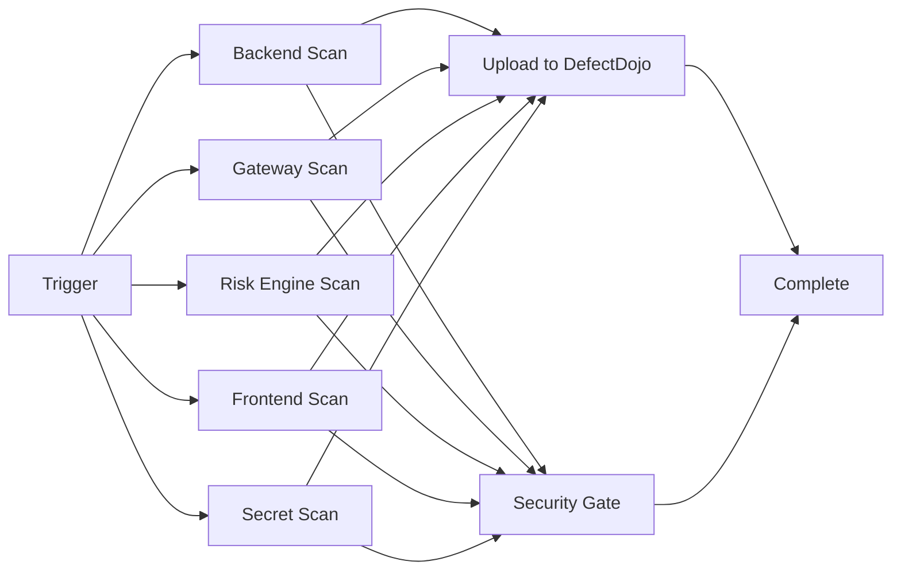

# GitHub Actions Security Scanning Workflow

This directory contains the GitHub Actions workflow that automatically runs security scans and uploads results to DefectDojo.

## 🎯 What It Does

The workflow automates your entire security scanning process:

### 🔍 **Scans Performed**

1. **Backend (Java/Maven)**
   - OWASP Dependency Check (CVE scanning)
   - SpotBugs (security bugs)
   - Checkstyle (code quality)

2. **Gateway (Java/Maven)**
   - Same as Backend

3. **Risk Engine (Java/Maven)**
   - Same as Backend

4. **Frontend (Node.js/npm)**
   - npm audit (dependency vulnerabilities)
   - ESLint Security Plugin
   - Retire.js (known vulnerable libraries)

5. **Secret Scanning**
   - Gitleaks (credentials, API keys, tokens)

### 📤 **Upload to DefectDojo**

All scan results are automatically uploaded to your DefectDojo instance at:
**https://defectdojo-s74m.onrender.com**

## 🚀 Setup Instructions

### 1. Configure GitHub Secrets

Go to your repository → Settings → Secrets and variables → Actions

Add these secrets:

| Secret Name | Description | Required |
|-------------|-------------|----------|
| `DEFECTDOJO_URL` | DefectDojo URL (default: your Render instance) | No |
| `DEFECTDOJO_USERNAME` | Admin username (default: `admin`) | No |
| `DEFECTDOJO_PASSWORD` | Admin password | **YES** |
| `NVD_API_KEY` | NVD API key for OWASP Dependency Check | **HIGHLY RECOMMENDED** |

**Critical Secrets to Add:**

```bash
# In GitHub UI:

# 1. DefectDojo Authentication (Required)
Name: DEFECTDOJO_PASSWORD
Value: <your-defectdojo-admin-password>

# 2. NVD API Key (Highly Recommended - Makes OWASP scans 10-20x faster)
Name: NVD_API_KEY
Value: <your-nvd-api-key>
# Get one free at: https://nvd.nist.gov/developers/request-an-api-key
```

**⚠️ Without NVD_API_KEY:**
- OWASP scans will take 30-60+ minutes (may timeout)
- Rate limited to 5 requests per 30 seconds
- May fail to download complete CVE database

**✅ With NVD_API_KEY:**
- Scans complete in 2-5 minutes
- No rate limiting
- Always get latest CVE data

### 2. Make Python Script Executable

```bash
chmod +x compliance/scripts/upload-to-defectdojo.py
```

### 3. Verify Workflow File

The workflow is located at: `.github/workflows/security-scan.yml`

## 🎬 How to Trigger

### Automatic Triggers

The workflow runs automatically on:

- **Push** to `main`, `dev`, or `security-compliance` branches
- **Pull Requests** to `main` or `dev`
- **Schedule**: Daily at 2 AM UTC

### Manual Trigger

You can manually trigger the workflow:

1. Go to **Actions** tab in GitHub
2. Select **Security Compliance Scanning**
3. Click **Run workflow**
4. Choose options:
   - Select branch
   - Toggle "Upload to DefectDojo" (default: on)

## 📊 Workflow Stages



### Stage Details

1. **Parallel Scanning** (5-10 minutes)
   - All components scanned in parallel
   - Results saved as artifacts

2. **Upload to DefectDojo** (2-3 minutes)
   - Uploads all scan results
   - Tags findings by component
   - Reuses today's engagement

3. **Security Gate** (1 minute)
   - Analyzes findings
   - **Blocks** if secrets found
   - **Warns** on critical vulnerabilities

## 📈 Viewing Results

### In GitHub

1. Go to **Actions** tab
2. Click on a workflow run
3. View **Summary** for:
   - Security scan overview
   - Link to DefectDojo dashboard
   - Artifact downloads

### In DefectDojo

1. Visit: https://defectdojo-s74m.onrender.com
2. Login with your credentials
3. Navigate to **Dashboard**
4. View findings organized by:
   - Product: "Credit Default Swap Platform"
   - Engagement: "Security Scan - [date]"
   - Tags: backend, gateway, risk-engine, frontend, gitleaks

## 🛡️ Security Gate

The workflow includes a security quality gate:

| Finding | Action |
|---------|--------|
| 🔑 **Secrets Detected** | ❌ **FAIL** (blocks merge) |
| 🔴 **Critical Vulnerabilities** | ⚠️ **WARN** (doesn't block) |
| 🟠 **High Vulnerabilities** | ℹ️ **INFO** (informational) |

**Note:** You can adjust the gate rules in the workflow file at step `security-gate`.

## 🔧 Customization

### Change Scan Schedule

Edit `.github/workflows/security-scan.yml`:

```yaml
schedule:
  # Run at 6 AM UTC on weekdays only
  - cron: '0 6 * * 1-5'
```

### Add More Scans

Add a new job:

```yaml
new-component-scan:
  name: New Component Scan
  runs-on: ubuntu-latest
  steps:
    - uses: actions/checkout@v4
    - name: Run security scan
      run: |
        # Your scan commands
```

### Change DefectDojo Organization

Modify the upload step:

```yaml
- name: Upload scans to DefectDojo
  run: |
    python compliance/scripts/upload-to-defectdojo.py \
      --product "Your Product Name" \
      --engagement "Custom Engagement" \
      # ... other args
```

## 🐛 Troubleshooting

### Workflow Fails with "Authentication Failed"

**Problem:** DefectDojo credentials not set

**Solution:**
```bash
# Verify secret is set:
# GitHub UI → Settings → Secrets → DEFECTDOJO_PASSWORD

# Test manually:
python compliance/scripts/upload-to-defectdojo.py \
  --url https://defectdojo-s74m.onrender.com \
  --username admin \
  --password YOUR_PASSWORD \
  --product "Test" \
  --engagement "Test" \
  --scan-dir /tmp
```

### No Scan Results Found

**Problem:** Scan artifacts not generated

**Solution:**
- Check individual scan job logs
- Verify Maven/npm dependencies installed
- Run scans locally first: `./defectdojo.ps1 scan`

### Upload Fails with "Product Not Found"

**Problem:** Product doesn't exist in DefectDojo

**Solution:**
The script auto-creates products, but if it fails:
1. Login to DefectDojo
2. Manually create product: "Credit Default Swap Platform"
3. Rerun workflow

### DefectDojo Timeout

**Problem:** DefectDojo on Render.com may be sleeping

**Solution:**
- Visit https://defectdojo-s74m.onrender.com to wake it up
- Wait 30-60 seconds for services to start
- Rerun workflow

## 📝 Local Testing

Test the workflow locally:

```powershell
# 1. Run scans locally
./defectdojo.ps1 scan

# 2. Test Python upload script
pip install requests python-dateutil

python compliance/scripts/upload-to-defectdojo.py \
  --url https://defectdojo-s74m.onrender.com \
  --username admin \
  --password YOUR_PASSWORD \
  --product "Credit Default Swap Platform" \
  --engagement "Test Upload" \
  --scan-dir . \
  --component-tags
```

## 📚 Additional Resources

- [DefectDojo API Documentation](https://demo.defectdojo.org/api/v2/doc/)
- [GitHub Actions Documentation](https://docs.github.com/en/actions)
- [OWASP Dependency Check](https://owasp.org/www-project-dependency-check/)
- [SpotBugs](https://spotbugs.github.io/)
- [Gitleaks](https://github.com/gitleaks/gitleaks)

## 🔄 Migration from Local Workflow

This replaces your local `./defectdojo.ps1` workflow:

| Local Command | GitHub Actions Equivalent |
|---------------|---------------------------|
| `./defectdojo.ps1 scan` | Automatic on push/PR/schedule |
| `./defectdojo.ps1 upload` | Automatic after scans |
| Manual review in DefectDojo | Same - view at DefectDojo URL |

**You can still use the local commands for development!**

## 🎉 Benefits

✅ **Automated** - Runs on every push/PR
✅ **Parallel** - All scans run simultaneously
✅ **Fast** - GitHub's infrastructure
✅ **Integrated** - Results in PR comments
✅ **Persistent** - All results stored in DefectDojo
✅ **Scheduled** - Daily scans for monitoring
✅ **Gated** - Blocks merges on critical issues

---

**Questions?** Check the workflow logs in the Actions tab or review DefectDojo upload logs.
