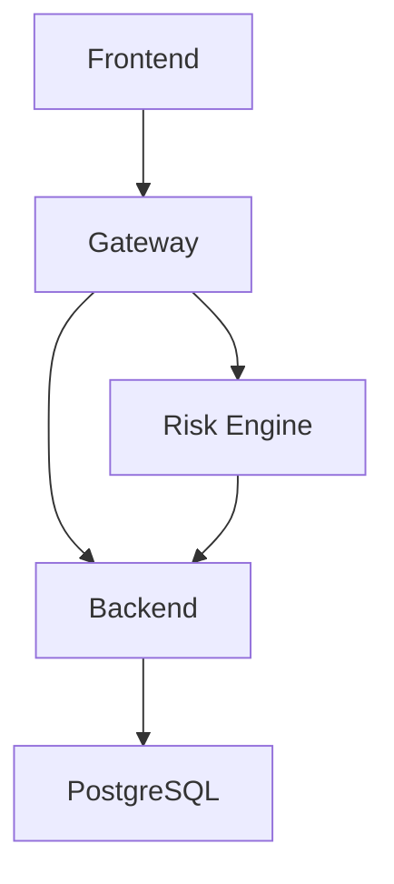

# 🚀 CDS Platform Operations Runbook

**Last Updated**: November 14, 2025  
**Platform Version**: 1.0.0  
**Document Owner**: Platform Operations Team

---

## 📋 Table of Contents

1. [System Overview](#system-overview)
2. [Architecture](#architecture)
3. [Quick Start](#quick-start)
4. [Service Management](#service-management)
5. [Health Checks & Monitoring](#health-checks--monitoring)
6. [Common Operations](#common-operations)
7. [Troubleshooting](#troubleshooting)
8. [Emergency Procedures](#emergency-procedures)
9. [Backup & Recovery](#backup--recovery)
10. [Performance Tuning](#performance-tuning)
11. [Security](#security)
12. [Contact Information](#contact-information)

---

## System Overview

### What is CDS Platform?

The **Credit Default Swap (CDS) Platform** is a comprehensive trading and risk management system for credit derivatives. It handles:

- **Trade Capture**: Single-name CDS, index CDS, baskets, and corporate bonds
- **Lifecycle Management**: Trade amendments, novations, terminations, credit events
- **Pricing & Valuation**: Mark-to-market, NPV calculation via ORE integration
- **Risk Analytics**: Delta, CS01, DV01, correlation analysis, Monte Carlo simulation
- **EOD Processing**: Daily valuation jobs, P&L calculation, position aggregation
- **Accounting Integration**: GL posting events, reconciliation
- **Margin & Clearing**: Automated margin calculations, LCH integration

### Technology Stack

- **Backend**: Spring Boot 3.2, Java 21
- **Frontend**: React 18, TypeScript, Tailwind CSS
- **Database**: PostgreSQL 16
- **Risk Engine**: ORE (Open Risk Engine)
- **API Gateway**: Spring Cloud Gateway
- **Container Platform**: Docker Compose
- **Build Tools**: Maven, npm

---

## Architecture

### Service Components

```
┌─────────────────────────────────────────────────────────────┐
│                         Frontend                             │
│                    React App (Port 3000)                     │
│              Nginx serving static content                    │
└──────────────────────┬──────────────────────────────────────┘
                       │
                       ▼
┌─────────────────────────────────────────────────────────────┐
│                      API Gateway                             │
│                  Spring Cloud Gateway                        │
│                      (Port 8081)                             │
└──────┬───────────────────────────────────────────┬──────────┘
       │                                           │
       ▼                                           ▼
┌──────────────────────┐              ┌───────────────────────┐
│   Backend Service    │              │    Risk Engine        │
│   Spring Boot App    │◄─────────────┤   ORE Integration     │
│     (Port 8080)      │              │     (Port 8082)       │
└──────────┬───────────┘              └───────────────────────┘
           │
           ▼
┌──────────────────────┐
│    PostgreSQL DB     │
│     (Port 5432)      │
└──────────────────────┘
```

### Network Ports

| Service      | Internal Port | External Port | Purpose                          |
|--------------|---------------|---------------|----------------------------------|
| Frontend     | 80            | 3000          | Web UI (Nginx)                   |
| Gateway      | 8081          | 8081          | API routing & aggregation        |
| Backend      | 8080          | 8080          | Core business logic              |
| Risk Engine  | 8082          | 8082          | Pricing & risk calculations      |
| PostgreSQL   | 5432          | 5432          | Primary database                 |

### Data Flow

1. **User Request**: Browser → Frontend (nginx) → Gateway → Backend/Risk Engine
2. **Trade Pricing**: Backend → Risk Engine → ORE Binary → Response
3. **Database**: Backend ↔ PostgreSQL (Hibernate/JPA)
4. **EOD Jobs**: Scheduled → Backend → Valuation → Database Update

---

## Quick Start

### Prerequisites

- **Docker Desktop** 4.20+ (with Docker Compose V2)
- **PowerShell 5.1+** (Windows) or **Bash** (Linux/Mac)
- **Minimum**: 8GB RAM, 4 CPU cores, 20GB disk space
- **Recommended**: 16GB RAM, 8 CPU cores, 50GB disk space

### Starting the Platform

**Windows (PowerShell)**:
```powershell
# Navigate to project root
cd D:\Repos\credit-default-swap

# Build and start all services
docker-compose up --build -d

# Check service status
docker-compose ps

# View logs
docker-compose logs -f
```

**Linux/Mac (Bash)**:
```bash
# Navigate to project root
cd /path/to/credit-default-swap

# Build and start all services
docker-compose up --build -d

# Check service status
docker-compose ps

# View logs
docker-compose logs -f
```

### Startup Verification

Wait for all services to become healthy (typically 2-3 minutes):

```powershell
# Check health endpoints
curl http://localhost:8080/actuator/health    # Backend
curl http://localhost:8081/actuator/health    # Gateway
curl http://localhost:8082/actuator/health    # Risk Engine
curl http://localhost:3000                    # Frontend

# Or use the automated check (Windows)
$response = Invoke-WebRequest -Uri "http://localhost:8080/api/health" -UseBasicParsing
$response.StatusCode  # Should return 200
```

### Accessing the Platform

- **Web UI**: http://localhost:3000
- **API Gateway**: http://localhost:8081
- **Backend API**: http://localhost:8080
- **API Docs**: http://localhost:8080/swagger-ui.html (if enabled)
- **Database**: `postgresql://localhost:5432/cdsplatform` (user: `cdsuser`, pass: `cdspass`)

---

## Service Management

### Starting Services

```powershell
# Start all services
docker-compose up -d

# Start specific service(s)
docker-compose up -d backend frontend

# Start with rebuild
docker-compose up --build -d

# Start with logs visible
docker-compose up
```

### Stopping Services

```powershell
# Stop all services (preserve data)
docker-compose stop

# Stop and remove containers (preserve data)
docker-compose down

# Stop and remove containers + volumes (⚠️ DELETES DATA)
docker-compose down -v

# Stop specific service
docker-compose stop backend
```

### Restarting Services

```powershell
# Restart all services
docker-compose restart

# Restart specific service
docker-compose restart backend

# Rebuild and restart specific service
docker-compose build backend
docker-compose up -d backend
```

### Viewing Logs

```powershell
# Follow all logs
docker-compose logs -f

# Follow specific service logs
docker-compose logs -f backend

# Last 100 lines
docker logs credit-default-swap-backend-1 --tail 100

# Search logs for errors
docker logs credit-default-swap-backend-1 --tail 500 | Select-String -Pattern "ERROR|Exception"

# Export logs to file
docker logs credit-default-swap-backend-1 > backend-logs.txt
```

### Scaling Services

```powershell
# Scale backend to 3 instances (requires load balancer)
docker-compose up -d --scale backend=3
```

---

## Health Checks & Monitoring

### Service Health Endpoints

| Service      | Health Endpoint                              | Expected Response           |
|--------------|----------------------------------------------|-----------------------------|
| Backend      | http://localhost:8080/actuator/health        | `{"status":"UP"}`           |
| Gateway      | http://localhost:8081/actuator/health        | `{"status":"UP"}`           |
| Risk Engine  | http://localhost:8082/actuator/health        | `{"status":"UP"}`           |
| Frontend     | http://localhost:3000                        | HTTP 200 (HTML page)        |
| Database     | `pg_isready -U cdsuser`                      | Exit code 0                 |

### Quick Health Check Script (PowerShell)

```powershell
# Save as check-health.ps1
$services = @(
    @{Name="Backend"; Url="http://localhost:8080/actuator/health"},
    @{Name="Gateway"; Url="http://localhost:8081/actuator/health"},
    @{Name="Risk Engine"; Url="http://localhost:8082/actuator/health"},
    @{Name="Frontend"; Url="http://localhost:3000"}
)

foreach ($service in $services) {
    try {
        $response = Invoke-WebRequest -Uri $service.Url -UseBasicParsing -TimeoutSec 5
        if ($response.StatusCode -eq 200) {
            Write-Host "✅ $($service.Name): HEALTHY" -ForegroundColor Green
        } else {
            Write-Host "⚠️ $($service.Name): Unexpected status $($response.StatusCode)" -ForegroundColor Yellow
        }
    } catch {
        Write-Host "❌ $($service.Name): DOWN" -ForegroundColor Red
    }
}
```

### Database Health Check

```powershell
# Connect to database
docker exec -it credit-default-swap-db-1 psql -U cdsuser -d cdsplatform

# Inside psql:
\dt                    # List tables
\l                     # List databases
SELECT COUNT(*) FROM cds_trades;  # Check trade count
\q                     # Exit
```

### Container Resource Usage

```powershell
# View resource usage
docker stats

# View specific container
docker stats credit-default-swap-backend-1

# Export stats to CSV
docker stats --no-stream --format "table {{.Container}}\t{{.CPUPerc}}\t{{.MemUsage}}\t{{.NetIO}}" > stats.csv
```

### Log Monitoring

```powershell
# Monitor for errors in real-time
docker-compose logs -f | Select-String -Pattern "ERROR|WARN|Exception"

# Count errors in last hour
docker logs credit-default-swap-backend-1 --since 1h | Select-String -Pattern "ERROR" | Measure-Object

# Check for specific error patterns
docker logs credit-default-swap-backend-1 --tail 1000 | Select-String -Pattern "OutOfMemory|Connection refused|Timeout"
```

---

## Common Operations

### 1. Triggering an EOD Valuation Job

**Via UI**:
1. Navigate to http://localhost:3000/eod-jobs
2. Select the valuation date (defaults to today)
3. Click "Trigger Job"
4. Choose DRY RUN (testing) or LIVE RUN (production)
5. Monitor progress in the UI

**Via API**:
```powershell
# Trigger EOD job for today (Dry Run)
$body = @{
    valuationDate = "2025-11-14"
    dryRun = $true
} | ConvertTo-Json

$response = Invoke-WebRequest -Uri "http://localhost:8080/api/eod/valuation-jobs/trigger" `
    -Method POST `
    -ContentType "application/json" `
    -Body $body `
    -UseBasicParsing

$response.Content | ConvertFrom-Json
```

**Expected Response**:
```json
{
  "jobId": "EOD-20251114-cc4d2045",
  "message": "EOD valuation job triggered successfully",
  "status": "SUCCESS"
}
```

**Monitoring Job Progress**:
```powershell
# Get job status
$response = Invoke-WebRequest -Uri "http://localhost:8080/api/eod/valuation-jobs/date/2025-11-14" -UseBasicParsing
$response.Content | ConvertFrom-Json | ConvertTo-Json -Depth 5
```

### 2. Creating a CDS Trade

**Via UI**:
1. Navigate to http://localhost:3000/cds-trades
2. Click "New Trade"
3. Fill in trade details (reference entity, notional, spread, etc.)
4. Click "Submit"

**Via API**:
```powershell
$trade = @{
    tradeId = "TR-CDS-$(Get-Date -Format 'yyyyMMdd-HHmmss')"
    referenceEntity = "TSLA"
    notionalAmount = 10000000
    currency = "USD"
    spread = 250
    tradeDate = "2025-11-14"
    effectiveDate = "2025-11-15"
    maturityDate = "2030-06-20"
    buySellIndicator = "BUY"
    counterparty = "MS"
    recoveryRate = 0.40
} | ConvertTo-Json

Invoke-WebRequest -Uri "http://localhost:8080/api/cds-trades" `
    -Method POST `
    -ContentType "application/json" `
    -Body $trade `
    -UseBasicParsing
```

### 3. Pricing a Trade

**Via UI**:
1. Navigate to the trade detail page
2. Click "Price Trade"
3. View NPV and risk measures

**Via API**:
```powershell
# Price specific trade
$response = Invoke-WebRequest -Uri "http://localhost:8080/api/cds-trades/{tradeId}/price" `
    -Method POST `
    -UseBasicParsing

$response.Content | ConvertFrom-Json
```

### 4. Uploading Market Data

```powershell
# Upload CDS spreads
$spreads = @{
    "TSLA" = 250
    "AAPL" = 45
    "MSFT" = 35
} | ConvertTo-Json

Invoke-WebRequest -Uri "http://localhost:8080/api/market-data/spreads?date=2025-11-14" `
    -Method POST `
    -ContentType "application/json" `
    -Body $spreads `
    -UseBasicParsing

# Upload recovery rates
$recoveryRates = @{
    "TSLA" = 0.40
    "AAPL" = 0.40
    "MSFT" = 0.40
} | ConvertTo-Json

Invoke-WebRequest -Uri "http://localhost:8080/api/market-data/recovery-rates?date=2025-11-14" `
    -Method POST `
    -ContentType "application/json" `
    -Body $recoveryRates `
    -UseBasicParsing
```

### 5. Running Portfolio Simulation

**Via UI**:
1. Navigate to Portfolio Aggregation page
2. Select portfolio
3. Click "Run Simulation"
4. Configure parameters (scenarios, horizons, confidence levels)
5. View results and metrics

### 6. Viewing Accounting Events

**Via UI**:
1. Navigate to http://localhost:3000/accounting-events
2. Select date range
3. Filter by status (PENDING, POSTED, FAILED)
4. Export to CSV if needed

**Via API**:
```powershell
# Get accounting events for date
$response = Invoke-WebRequest -Uri "http://localhost:8080/api/accounting/events/2025-11-14" -UseBasicParsing
$response.Content | ConvertFrom-Json | ConvertTo-Json -Depth 3
```

---

## Troubleshooting

### Problem: Service Won't Start

**Symptoms**: Container exits immediately or stays in "Restarting" state

**Diagnosis**:
```powershell
# Check container logs
docker logs credit-default-swap-backend-1 --tail 100

# Check container status
docker-compose ps
```

**Common Causes & Solutions**:

1. **Port Already in Use**:
   ```powershell
   # Find process using port 8080
   netstat -ano | findstr :8080
   
   # Kill the process (replace PID)
   taskkill /PID <PID> /F
   ```

2. **Database Not Ready**:
   ```powershell
   # Check database health
   docker logs credit-default-swap-db-1 --tail 50
   
   # Verify database is accepting connections
   docker exec -it credit-default-swap-db-1 pg_isready -U cdsuser
   ```

3. **Out of Memory**:
   ```powershell
   # Increase Docker memory limit in Docker Desktop settings
   # Minimum: 8GB, Recommended: 12GB
   
   # Check current memory usage
   docker stats --no-stream
   ```

4. **Dependency Issue**:
   ```powershell
   # Rebuild with no cache
   docker-compose build --no-cache backend
   docker-compose up -d backend
   ```

### Problem: 500 Internal Server Error

**Symptoms**: API returns HTTP 500 errors

**Diagnosis**:
```powershell
# Check backend logs for exceptions
docker logs credit-default-swap-backend-1 --tail 200 | Select-String -Pattern "ERROR|Exception" -Context 5,5

# Check database connectivity
docker exec -it credit-default-swap-backend-1 wget -O- http://localhost:8080/actuator/health
```

**Common Causes**:

1. **Database Connection Lost**:
   ```powershell
   # Restart database
   docker-compose restart db
   
   # Wait 10 seconds
   Start-Sleep -Seconds 10
   
   # Restart backend
   docker-compose restart backend
   ```

2. **Missing Market Data**:
   - Upload market data for the valuation date
   - See section 4 in Common Operations

3. **Invalid Configuration**:
   - Check `application.yml` for correct values
   - Verify environment variables in `docker-compose.yml`

### Problem: EOD Job Fails

**Symptoms**: EOD valuation job status shows FAILED

**Diagnosis**:
```powershell
# Get job details
$response = Invoke-WebRequest -Uri "http://localhost:8080/api/eod/valuation-jobs/date/2025-11-14" -UseBasicParsing
$job = $response.Content | ConvertFrom-Json

# Check error message
$job.errorMessage

# Check failed steps
$job.steps | Where-Object { $_.status -eq "FAILED" }
```

**Common Causes**:

1. **Missing Market Data**:
   - Upload spreads and recovery rates for the valuation date
   - Re-trigger the job

2. **No Active Trades**:
   - Verify trades exist for the date
   - Check trade status (should be ACTIVE)

3. **Risk Engine Timeout**:
   - Check risk-engine logs
   - Increase timeout in configuration
   - Restart risk-engine service

### Problem: Cannot Trigger EOD Job (409 Conflict)

**Symptoms**: "EOD job already exists for date: YYYY-MM-DD"

**Cause**: A job already exists for this date

**Solution**:
```powershell
# Option 1: View the existing job
$response = Invoke-WebRequest -Uri "http://localhost:8080/api/eod/valuation-jobs/date/2025-11-14" -UseBasicParsing
$response.Content | ConvertFrom-Json

# Option 2: Trigger for a different date
# Change the date in the UI date picker before clicking "Trigger Job"

# Option 3: Delete the existing job (if needed)
# Currently not supported via API - requires direct database access
# USE WITH CAUTION - ONLY IN DEV/TEST ENVIRONMENTS
docker exec -it credit-default-swap-db-1 psql -U cdsuser -d cdsplatform -c "DELETE FROM eod_valuation_jobs WHERE valuation_date = '2025-11-14';"
```

### Problem: Frontend Not Loading

**Symptoms**: Blank page or "Cannot connect" error

**Diagnosis**:
```powershell
# Check frontend container
docker logs credit-default-swap-frontend-1 --tail 50

# Verify nginx is running
docker exec -it credit-default-swap-frontend-1 nginx -t

# Check if files are present
docker exec -it credit-default-swap-frontend-1 ls -la /usr/share/nginx/html
```

**Solutions**:

1. **Rebuild Frontend**:
   ```powershell
   cd frontend
   npm run build
   cd ..
   docker-compose build frontend
   docker-compose up -d frontend
   ```

2. **Clear Browser Cache**:
   - Press Ctrl+Shift+Del
   - Clear cache and reload (Ctrl+F5)

3. **Check API Gateway**:
   ```powershell
   # Verify gateway is routing correctly
   curl http://localhost:8081/api/health
   ```

### Problem: Database Connection Issues

**Symptoms**: "Connection refused" or "Could not connect to database"

**Diagnosis**:
```powershell
# Check if database is running
docker-compose ps db

# Check database logs
docker logs credit-default-swap-db-1 --tail 100

# Try connecting directly
docker exec -it credit-default-swap-db-1 psql -U cdsuser -d cdsplatform
```

**Solutions**:

1. **Database Container Crashed**:
   ```powershell
   docker-compose restart db
   Start-Sleep -Seconds 10
   docker-compose restart backend
   ```

2. **Wrong Credentials**:
   - Verify `.env` file or `docker-compose.yml` has correct credentials
   - Default: user=`cdsuser`, password=`cdspass`, database=`cdsplatform`

3. **Database Corruption**:
   ```powershell
   # ⚠️ DESTRUCTIVE - Only in dev/test
   docker-compose down -v
   docker-compose up -d
   ```

### Problem: Performance Degradation

**Symptoms**: Slow API responses, high CPU/memory usage

**Diagnosis**:
```powershell
# Check resource usage
docker stats

# Check database connections
docker exec -it credit-default-swap-db-1 psql -U cdsuser -d cdsplatform -c "SELECT count(*) FROM pg_stat_activity;"

# Check backend threads
docker exec -it credit-default-swap-backend-1 ps aux
```

**Solutions**:

1. **Increase Resources**:
   - Increase Docker Desktop memory limit
   - Add more CPU cores

2. **Database Query Optimization**:
   ```sql
   -- Check slow queries
   SELECT query, mean_exec_time, calls 
   FROM pg_stat_statements 
   ORDER BY mean_exec_time DESC 
   LIMIT 10;
   ```

3. **Restart Services**:
   ```powershell
   docker-compose restart
   ```

---

## Emergency Procedures

### Critical Service Failure

**When**: Backend/Gateway/Database is down and unresponsive

**Actions**:
1. **Alert**: Notify team immediately
2. **Assess**: Check logs and health endpoints
3. **Attempt Quick Recovery**:
   ```powershell
   docker-compose restart backend gateway db
   ```
4. **If Unsuccessful**: Full restart
   ```powershell
   docker-compose down
   docker-compose up -d
   ```
5. **Document**: Record incident, cause, and resolution

### Data Corruption

**When**: Database shows inconsistent data or errors

**Actions**:
1. **Stop All Services**:
   ```powershell
   docker-compose stop
   ```
2. **Backup Current State**:
   ```powershell
   docker exec credit-default-swap-db-1 pg_dump -U cdsuser cdsplatform > backup_corrupted_$(Get-Date -Format 'yyyyMMdd_HHmmss').sql
   ```
3. **Restore from Latest Backup**:
   ```powershell
   # See Backup & Recovery section
   ```
4. **Verify Data Integrity**:
   ```sql
   -- Run data validation queries
   SELECT COUNT(*) FROM cds_trades WHERE status IS NULL;
   ```
5. **Resume Operations**:
   ```powershell
   docker-compose start
   ```

### Security Breach

**When**: Unauthorized access detected

**Actions**:
1. **Isolate**: Stop external network access
   ```powershell
   docker-compose down
   ```
2. **Alert**: Contact security team immediately
3. **Assess**: Review logs for unauthorized activities
4. **Change Credentials**: Update all passwords and API keys
5. **Review**: Audit all recent changes
6. **Resume**: Only after security clearance

### Disk Space Full

**When**: Services fail due to no disk space

**Actions**:
1. **Check Disk Usage**:
   ```powershell
   docker system df
   ```
2. **Clean Up Docker**:
   ```powershell
   # Remove unused images, containers, networks
   docker system prune -a -f
   
   # Remove old logs
   docker-compose logs > logs_backup.txt
   docker-compose restart  # Truncates logs
   ```
3. **Clean Up Database**:
   ```powershell
   # Vacuum and analyze
   docker exec -it credit-default-swap-db-1 psql -U cdsuser -d cdsplatform -c "VACUUM FULL ANALYZE;"
   ```
4. **Archive Old Data**: Move historical data to archive storage

---

## Backup & Recovery

### Database Backup

**Manual Backup**:
```powershell
# Create backup
$timestamp = Get-Date -Format "yyyyMMdd_HHmmss"
docker exec credit-default-swap-db-1 pg_dump -U cdsuser cdsplatform > "backup_$timestamp.sql"

# Compress backup
Compress-Archive -Path "backup_$timestamp.sql" -DestinationPath "backup_$timestamp.zip"
```

**Automated Backup Script** (backup.ps1):
```powershell
# Save as backup.ps1
$BackupDir = "D:\Backups\cds-platform"
$RetentionDays = 30

# Create backup directory if not exists
New-Item -ItemType Directory -Force -Path $BackupDir | Out-Null

$timestamp = Get-Date -Format "yyyyMMdd_HHmmss"
$backupFile = "$BackupDir\backup_$timestamp.sql"

# Create backup
docker exec credit-default-swap-db-1 pg_dump -U cdsuser cdsplatform > $backupFile

# Compress
Compress-Archive -Path $backupFile -DestinationPath "$backupFile.zip"
Remove-Item $backupFile

# Remove old backups
Get-ChildItem -Path $BackupDir -Filter "*.zip" | 
    Where-Object { $_.LastWriteTime -lt (Get-Date).AddDays(-$RetentionDays) } | 
    Remove-Item -Force

Write-Host "Backup completed: $backupFile.zip"
```

**Schedule Daily Backups** (Windows Task Scheduler):
```powershell
# Run as Administrator
$action = New-ScheduledTaskAction -Execute "PowerShell.exe" -Argument "-File D:\Scripts\backup.ps1"
$trigger = New-ScheduledTaskTrigger -Daily -At 2am
$principal = New-ScheduledTaskPrincipal -UserID "NT AUTHORITY\SYSTEM" -LogonType ServiceAccount
Register-ScheduledTask -Action $action -Trigger $trigger -Principal $principal -TaskName "CDS Platform Backup" -Description "Daily backup of CDS Platform database"
```

### Database Restore

**From Backup File**:
```powershell
# Stop services
docker-compose stop backend gateway frontend

# Drop and recreate database
docker exec -it credit-default-swap-db-1 psql -U cdsuser -c "DROP DATABASE cdsplatform;"
docker exec -it credit-default-swap-db-1 psql -U cdsuser -c "CREATE DATABASE cdsplatform;"

# Restore backup
Get-Content backup_20251114_120000.sql | docker exec -i credit-default-swap-db-1 psql -U cdsuser -d cdsplatform

# Restart services
docker-compose start backend gateway frontend
```

### Configuration Backup

```powershell
# Backup configuration files
$configFiles = @(
    "docker-compose.yml",
    "docker-compose.local.yml",
    "backend/src/main/resources/application.yml",
    "frontend/.env",
    "ore-setup/config/*"
)

$timestamp = Get-Date -Format "yyyyMMdd_HHmmss"
Compress-Archive -Path $configFiles -DestinationPath "config_backup_$timestamp.zip"
```

### Volume Backup

```powershell
# Backup PostgreSQL data volume
docker run --rm -v credit-default-swap_postgres_data:/data -v ${PWD}:/backup alpine tar czf /backup/postgres_volume_backup.tar.gz -C /data .

# Restore PostgreSQL data volume
docker run --rm -v credit-default-swap_postgres_data:/data -v ${PWD}:/backup alpine tar xzf /backup/postgres_volume_backup.tar.gz -C /data
```

---

## Performance Tuning

### Database Optimization

**Connection Pooling**:
```yaml
# backend/src/main/resources/application.yml
spring:
  datasource:
    hikari:
      maximum-pool-size: 20
      minimum-idle: 5
      connection-timeout: 30000
      idle-timeout: 600000
      max-lifetime: 1800000
```

**Index Creation**:
```sql
-- Create indexes for frequently queried columns
CREATE INDEX idx_cds_trades_reference_entity ON cds_trades(reference_entity);
CREATE INDEX idx_cds_trades_trade_date ON cds_trades(trade_date);
CREATE INDEX idx_cds_trades_status ON cds_trades(status);
CREATE INDEX idx_eod_jobs_valuation_date ON eod_valuation_jobs(valuation_date);
CREATE INDEX idx_accounting_events_date ON accounting_events(event_date);
```

**Query Optimization**:
```sql
-- Analyze query performance
EXPLAIN ANALYZE SELECT * FROM cds_trades WHERE reference_entity = 'TSLA';

-- Update statistics
ANALYZE cds_trades;
ANALYZE eod_valuation_jobs;
```

### JVM Tuning

```dockerfile
# backend/Dockerfile - Add JVM options
ENV JAVA_OPTS="-Xms2g -Xmx4g -XX:+UseG1GC -XX:MaxGCPauseMillis=200"
```

### Docker Resource Limits

```yaml
# docker-compose.yml - Add resource limits
services:
  backend:
    deploy:
      resources:
        limits:
          cpus: '2.0'
          memory: 4G
        reservations:
          cpus: '1.0'
          memory: 2G
```

### Caching Strategy

**Application-Level Caching**:
```java
// Enable caching in Spring Boot
@EnableCaching
public class CacheConfig {
    @Bean
    public CacheManager cacheManager() {
        return new ConcurrentMapCacheManager("marketData", "trades", "prices");
    }
}
```

---

## Security

### Access Control

**Database Access**:
- Default credentials are for **development only**
- Production: Use strong passwords, rotate regularly
- Limit database access to backend container only

**API Security**:
- Implement OAuth2/JWT authentication (not yet configured)
- Use HTTPS in production
- Enable CORS with specific origins only

**Container Security**:
```powershell
# Scan images for vulnerabilities
docker scan credit-default-swap-backend:latest

# Run containers as non-root user (configure in Dockerfile)
```

### Secrets Management

**Environment Variables**:
```powershell
# Use .env file (never commit to Git)
# .env file structure:
POSTGRES_PASSWORD=strong_password_here
JWT_SECRET=your_jwt_secret_here
API_KEY=your_api_key_here
```

**Docker Secrets** (Production):
```yaml
# docker-compose.yml
services:
  backend:
    secrets:
      - db_password
secrets:
  db_password:
    file: ./secrets/db_password.txt
```

### Network Security

```yaml
# docker-compose.yml - Internal network
networks:
  cds_internal:
    driver: bridge
    internal: true  # No external access

services:
  db:
    networks:
      - cds_internal  # Only accessible internally
```

### Audit Logging

```powershell
# Enable audit logging
docker logs credit-default-swap-backend-1 | Select-String -Pattern "audit" > audit_log.txt
```

---

## Contact Information

### Support Channels

- **Platform Team Lead**: platform-lead@company.com
- **DevOps Team**: devops@company.com
- **Security Team**: security@company.com
- **Slack Channel**: #cds-platform-support

### Escalation Path

1. **Level 1**: Platform Developer (Response: 30 min)
2. **Level 2**: Senior Engineer (Response: 1 hour)
3. **Level 3**: Platform Architect (Response: 2 hours)
4. **Level 4**: CTO (Critical incidents only)

### On-Call Schedule

- **Weekdays 9am-6pm**: Primary team
- **After Hours**: On-call rotation (see PagerDuty)
- **Weekends**: On-call engineer only

### Documentation Resources

- **GitHub Wiki**: https://github.com/faculax/credit-default-swap/wiki
- **API Documentation**: http://localhost:8080/swagger-ui.html
- **User Stories**: `/user-stories/` directory
- **Testing Guide**: `DAILY_PNL_TESTING_GUIDE.md`
- **Quick Start**: `QUICK_START_DAILY_PNL.md`

---

## Appendix

### Environment Variables Reference

| Variable                    | Service    | Default Value                                  | Description                          |
|-----------------------------|------------|------------------------------------------------|--------------------------------------|
| POSTGRES_DB                 | db         | cdsplatform                                    | Database name                        |
| POSTGRES_USER               | db         | cdsuser                                        | Database username                    |
| POSTGRES_PASSWORD           | db         | cdspass                                        | Database password                    |
| SPRING_PROFILES_ACTIVE      | backend    | dev                                            | Spring Boot profile                  |
| SPRING_DATASOURCE_URL       | backend    | jdbc:postgresql://db:5432/cdsplatform          | JDBC connection string               |
| SERVER_PORT                 | backend    | 8080                                           | Backend listening port               |
| BACKEND_URI                 | gateway    | http://backend:8080                            | Backend service URL                  |
| RISK_ENGINE_URI             | gateway    | http://risk-engine:8082                        | Risk engine service URL              |
| REACT_APP_API_BASE_URL      | frontend   | /api                                           | API base URL for frontend            |
| RISK_IMPL                   | risk-engine| ORE                                            | Risk implementation type             |
| ORE_BINARY_PATH             | risk-engine| /app/ore/bin/ore                               | Path to ORE binary                   |

### Common Docker Commands

```powershell
# List all containers
docker ps -a

# List all images
docker images

# Remove stopped containers
docker container prune

# Remove unused images
docker image prune -a

# View container details
docker inspect credit-default-swap-backend-1

# Execute command in container
docker exec -it credit-default-swap-backend-1 bash

# Copy file from container
docker cp credit-default-swap-backend-1:/app/logs/app.log ./app.log

# Copy file to container
docker cp config.yml credit-default-swap-backend-1:/app/config/

# View port mappings
docker port credit-default-swap-backend-1
```

### Database Maintenance

```sql
-- Check database size
SELECT pg_size_pretty(pg_database_size('cdsplatform'));

-- Check table sizes
SELECT 
    schemaname,
    tablename,
    pg_size_pretty(pg_total_relation_size(schemaname||'.'||tablename)) AS size
FROM pg_tables
WHERE schemaname = 'public'
ORDER BY pg_total_relation_size(schemaname||'.'||tablename) DESC;

-- Check active connections
SELECT 
    datname,
    count(*) as connections
FROM pg_stat_activity
GROUP BY datname;

-- Kill long-running queries
SELECT 
    pid,
    now() - pg_stat_activity.query_start AS duration,
    query,
    state
FROM pg_stat_activity
WHERE (now() - pg_stat_activity.query_start) > interval '5 minutes'
AND state = 'active';

-- Kill specific query
SELECT pg_terminate_backend(pid);

-- Vacuum database
VACUUM ANALYZE;

-- Reindex database
REINDEX DATABASE cdsplatform;
```

### Service Dependencies



---

**Document Version**: 1.0.0  
**Last Reviewed**: November 14, 2025  
**Next Review Date**: December 14, 2025
