# CDs Application - System Architecture & End-to-End Flow

## 📋 Table of Contents
- [Overview](#overview)
- [System Components](#system-components)
- [CI/CD Pipeline Flow](#cicd-pipeline-flow)
- [Runtime Architecture](#runtime-architecture)
- [Technology Stack](#technology-stack)

---

## 🎯 Overview

This document describes the end-to-end architecture of the CDs (Credit Default Swaps) application, including the CI/CD pipeline and runtime request flow. The system consists of a React frontend, API Gateway, two backend services (Core Business Logic and Risk Engine), and PostgreSQL database, all deployed on Render.

---

## 🏗️ System Components

| Component | Technology | Purpose | Deployed On |
|-----------|-----------|---------|-------------|
| **Frontend** | React | User interface and client-side logic | Render |
| **API Gateway** | Java | Request routing and API management | Render |
| **Backend Core** | Java | CDS business logic and operations | Render |
| **Risk Engine** | Java | Risk calculations and analytics | Render |
| **Database** | PostgreSQL | Data persistence | Render |

---

## 🔄 CI/CD Pipeline Flow

The following diagram illustrates the complete CI/CD pipeline from code commit to production deployment.

```mermaid
graph TB
    subgraph "Development"
        A[👨‍💻 Developer Commits Code]
        B[📦 GitHub Repository]
    end
    
    subgraph "CI Pipeline - GitHub Actions"
        C[🚀 GitHub Actions Triggered]
        D[🔨 Build Applications]
        E[✅ Run Unit Tests]
        F[🔗 Run Integration Tests]
        G{Tests Passed?}
        I[🔒 SAST Scanning]
        J[📊 Send Results to DefectDojo]
        K{Security Check?}
        L[🐳 Build Docker Images]
        M[📤 Push to Container Registry]
    end
    
    subgraph "Deployment - Render Platform"
        N[🚢 Deploy to Render]
        O[⚛️ Deploy Frontend]
        P[🌐 Deploy API Gateway]
        Q[⚙️ Deploy Backend Core]
        R[📈 Deploy Risk Engine]
        S[🗄️ PostgreSQL Database]
    end
    
    subgraph "Validation"
        T[✨ Deployment Complete]
        U[🧪 Run Smoke Tests]
        V{Smoke Tests?}
        X[✅ Production Ready]
        W[⏮️ Rollback Deployment]
    end
    
    subgraph "Failure Handling"
        H[❌ Pipeline Fails]
        H1[📧 Notify Developer]
    end
    
    A --> B
    B --> C
    C --> D
    D --> E
    E --> F
    F --> G
    G -->|✅ Yes| I
    G -->|❌ No| H
    I --> J
    J --> K
    K -->|❌ Critical Issues| H
    K -->|✅ Passed| L
    L --> M
    M --> N
    N --> O
    N --> P
    N --> Q
    N --> R
    N --> S
    O --> T
    P --> T
    Q --> T
    R --> T
    S --> T
    T --> U
    U --> V
    V -->|✅ Yes| X
    V -->|❌ No| W
    H --> H1
    
    classDef development fill:#e1f5ff,stroke:#0066cc,stroke-width:2px
    classDef cicd fill:#fff3cd,stroke:#ffc107,stroke-width:2px
    classDef deployment fill:#d4edda,stroke:#28a745,stroke-width:2px
    classDef validation fill:#d1ecf1,stroke:#17a2b8,stroke-width:2px
    classDef failure fill:#f8d7da,stroke:#dc3545,stroke-width:2px
    
    class A,B development
    class C,D,E,F,G,I,J,K,L,M cicd
    class N,O,P,Q,R,S deployment
    class T,U,V,X,W validation
    class H,H1 failure
```



### Pipeline Stages

1. **Code Commit**: Developer pushes code to GitHub repository
2. **Build**: GitHub Actions builds all four applications
3. **Testing**: Executes unit and integration tests
4. **Security Scanning**: SAST analysis with results sent to DefectDojo
5. **Containerization**: Builds Docker images for all services
6. **Deployment**: Parallel deployment to Render platform
7. **Validation**: Smoke tests verify deployment health
8. **Rollback**: Automatic rollback if validation fails

---

## 🌐 Runtime Architecture & Request Flow

The following diagram shows how requests flow through the system at runtime.


### Request Flow Explained

1. **User Interaction**: User interacts with React frontend via HTTPS
2. **API Gateway Routing**: 
   - Routes `/api/cds/*` requests to Backend Core Service
   - Routes `/api/risk/*` requests to Risk Engine Service
3. **Service Processing**:
   - Backend Core handles CDS business logic operations
   - Risk Engine performs risk calculations and analytics
   - Services can communicate with each other when needed
4. **Data Persistence**: Both services interact with PostgreSQL database
5. **Response Flow**: Results flow back through Gateway to Frontend and User

### API Endpoints Structure

```
/api
├── /cds
│   ├── /trades          # Trade management
│   ├── /positions       # Position tracking
│   └── /settlements     # Settlement operations
│
└── /risk
    ├── /calculate       # Risk calculations
    ├── /exposure        # Exposure analysis
    └── /reports         # Risk reports
```

---

## 🛠️ Technology Stack

### Frontend
- **Framework**: React
- **Deployment**: Render Static Site

### Backend Services
- **Language**: Java
- **Framework**: Spring Boot (assumed)
- **Build Tool**: Maven/Gradle
- **Containerization**: Docker

### Database
- **RDBMS**: PostgreSQL
- **Hosting**: Render PostgreSQL

### CI/CD & Security
- **Version Control**: GitHub
- **CI/CD**: GitHub Actions
- **SAST**: Static Application Security Testing
- **Vulnerability Management**: DefectDojo
- **Deployment Platform**: Render

### Testing
- **Unit Tests**: JUnit
- **Integration Tests**: Spring Boot Test / Testcontainers
- **Smoke Tests**: Post-deployment validation

---

## 🔐 Security Measures

1. **SAST Scanning**: Automated security scanning on every build
2. **DefectDojo Integration**: Centralized vulnerability management
3. **Pipeline Gating**: Deployment blocked on critical security issues
4. **HTTPS**: All external communication encrypted
5. **Database Security**: Managed PostgreSQL with Render's security features

---

## 📈 Deployment Strategy

- **Platform**: Render Cloud Platform
- **Strategy**: Parallel deployment of all services
- **Validation**: Smoke tests post-deployment
- **Rollback**: Automatic rollback on validation failure
- **Zero Downtime**: Render manages traffic switching

---

## 📝 Notes

- Inter-service communication between Backend Core and Risk Engine is optional and depends on business logic requirements
- All services are deployed as separate containers on Render
- Database connections use JDBC with connection pooling
- API Gateway handles authentication, rate limiting, and request routing

---

**Last Updated**: November 2025  
**Maintained By**: Development Team