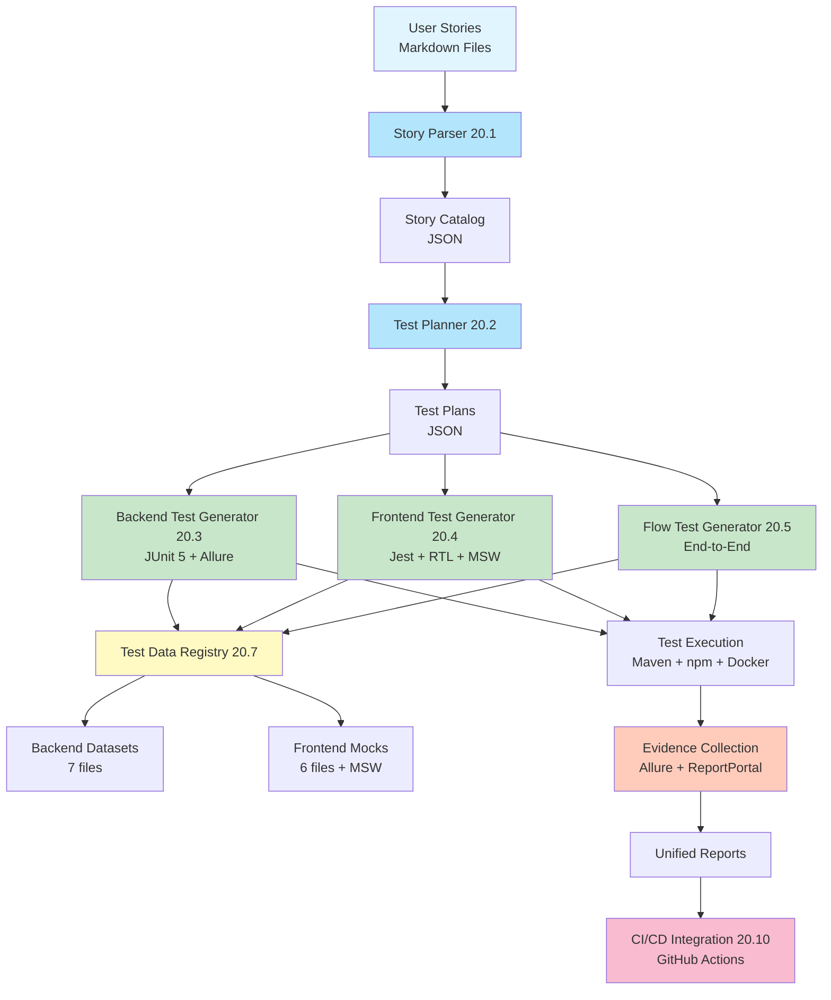

# Test Evidence Framework Architecture

**Version**: 1.0.0  
**Last Updated**: 2025-11-18  
**Status**: Stories 20.1, 20.2, 20.7 Complete | Stories 20.3-20.11 Planned

---

## 📋 Table of Contents

1. [Overview](#overview)
2. [Architecture Vision](#architecture-vision)
3. [System Components](#system-components)
4. [Implementation Status](#implementation-status)
5. [Data Flow](#data-flow)
6. [Technology Stack](#technology-stack)
7. [Directory Structure](#directory-structure)
8. [Core Modules](#core-modules)
9. [Test Data Registry](#test-data-registry)
10. [Test Generation Pipeline](#test-generation-pipeline)
11. [Integration Points](#integration-points)
12. [Usage Patterns](#usage-patterns)
13. [Future Enhancements](#future-enhancements)

---

## Overview

The **Test Evidence Framework** is an AI-assisted, story-driven test automation system designed to:

1. **Parse** user stories from markdown files
2. **Plan** comprehensive test coverage by service and test type
3. **Generate** backend (JUnit 5) and frontend (Jest + RTL) tests
4. **Manage** versioned test data and API mocks
5. **Execute** tests across all services with unified reporting
6. **Integrate** with Allure for visual test evidence
7. **Report** to ReportPortal for centralized test management
8. **Track** story-to-test-to-evidence traceability

### Key Principles

- **Story-Driven**: Every test traces back to a user story
- **Service-Aware**: Understands CDS platform's microservice architecture
- **Type-Safe**: TypeScript + Java with strong typing
- **Versioned**: Test data and mocks are versioned assets
- **Evidence-First**: Every test produces verifiable evidence
- **AI-Assisted**: LLM helps generate realistic test scenarios

---

## Architecture Vision

### High-Level Architecture



### Component Flow (Text Diagram)

```
┌─────────────────────────────────────────────────────────────────────┐
│                      TEST EVIDENCE FRAMEWORK                         │
└─────────────────────────────────────────────────────────────────────┘

┌──────────────────┐
│  User Stories    │ (Markdown)
│  /user-stories   │
└────────┬─────────┘
         │
         ▼
┌──────────────────┐     ┌──────────────────┐
│  Story Parser    │────▶│  Story Catalog   │
│  (20.1)          │     │  (JSON)          │
└────────┬─────────┘     └──────────────────┘
         │
         ▼
┌──────────────────┐     ┌──────────────────┐
│  Test Planner    │────▶│  Test Plans      │
│  (20.2)          │     │  (JSON)          │
└────────┬─────────┘     └──────────────────┘
         │
         ├─────────────────────────┬────────────────────────┐
         ▼                         ▼                        ▼
┌──────────────────┐     ┌──────────────────┐    ┌──────────────────┐
│ Backend Test Gen │     │ Frontend Test Gen│    │ Flow Test Gen    │
│ (20.3)           │     │ (20.4)           │    │ (20.5)           │
│ JUnit 5 + Allure │     │ Jest + RTL + MSW │    │ End-to-End       │
└────────┬─────────┘     └────────┬─────────┘    └────────┬─────────┘
         │                         │                        │
         │                         │                        │
         ▼                         ▼                        ▼
┌──────────────────────────────────────────────────────────────────┐
│                    Test Data & Mock Registry (20.7)              │
│  ┌────────────────┐              ┌────────────────┐             │
│  │ Backend Data   │              │ Frontend Mocks │             │
│  │ 7 Datasets     │              │ 6 Mocks        │             │
│  │ DatasetLoader  │              │ MSW Handlers   │             │
│  └────────────────┘              └────────────────┘             │
└──────────────────────────────────────────────────────────────────┘
         │                         │                        │
         ▼                         ▼                        ▼
┌──────────────────────────────────────────────────────────────────┐
│                    Test Execution Layer                           │
│  Maven (Backend) + npm (Frontend) + docker-compose (Integration) │
└────────┬─────────────────────────────────────────────────────────┘
         │
         ▼
┌──────────────────────────────────────────────────────────────────┐
│                    Evidence Collection                            │
│  Allure Results → Unified Report → ReportPortal → Static Export  │
└────────┬─────────────────────────────────────────────────────────┘
         │
         ▼
┌──────────────────────────────────────────────────────────────────┐
│                    CI/CD Integration (20.10)                      │
│  GitHub Actions → Test Execution → Evidence Upload → Dashboard   │
└──────────────────────────────────────────────────────────────────┘
```

---

## System Components

### Phase 1: Foundation (✅ Complete)

#### 1. Story Parser (Story 20.1) ✅
**Purpose**: Parse markdown user stories into structured data

**Features**:
- Markdown parsing with frontmatter support
- Section extraction (Acceptance Criteria, Test Cases, Services Involved)
- Service inference for stories missing explicit sections
- Story validation and error reporting
- JSON catalog generation

**Implementation**: `test-evidence-framework/src/parser/story-parser.ts`

#### 2. Test Planner (Story 20.2) ✅
**Purpose**: Map stories to comprehensive test plans by service

**Features**:
- Service-aware test type mapping
- Complexity estimation (Simple/Medium/Complex)
- Test count estimation by type
- Multi-service flow test detection
- Test plan catalog generation

**Implementation**: `test-evidence-framework/src/planner/test-planner.ts`

#### 3. Service Inference Engine ✅
**Purpose**: Automatically detect services from story content

**Features**:
- 60+ keyword dictionary (by service)
- Heuristic rules (frontend→gateway→backend)
- Confidence scoring
- Fallback to manual detection

**Implementation**: `test-evidence-framework/src/inference/service-inference.ts`

#### 4. Test Data Registry (Story 20.7) ✅
**Purpose**: Centralized, versioned test data and API mocks

**Backend Features**:
- 7 datasets covering CDS trades, market data, reference data, credit events, portfolios
- DatasetLoader utility (generic loading with type safety)
- TestDataRegistry singleton (multi-index querying)
- SHA-256 checksum validation
- Metadata tracking (usedBy, dependencies, validFrom/To)

**Frontend Features**:
- 6 API response mocks with MSW handlers
- 9 endpoint handlers (trades, pricing, market-data)
- Test setup examples (component, hook, form tests)
- Contract alignment with backend APIs

**Implementation**:
- Backend: `backend/src/test/resources/datasets/`
- Frontend: `frontend/src/__mocks__/`

### Phase 2: Test Generation (🔄 Next)

#### 5. Backend Test Generator (Story 20.3) 🔄
**Purpose**: Generate JUnit 5 tests for backend services

**Planned Features**:
- Template engine for Service/Repository/Controller tests
- Allure annotation integration (@Epic, @Feature, @Story)
- Dataset injection using DatasetLoader
- Test case generation from Acceptance Criteria
- Assertion generation based on expected outcomes
- Mock configuration for dependencies

**Target Services**: backend, gateway, risk-engine

**Output**: JUnit 5 test classes with Allure reporting

#### 6. Frontend Test Generator (Story 20.4) ⏳
**Purpose**: Generate Jest + React Testing Library tests

**Planned Features**:
- Template engine for Component/Hook/Form tests
- MSW handler integration
- Mock injection from registry
- User interaction simulation (userEvent)
- Accessibility testing patterns
- Loading/error state testing

**Target**: frontend React components

**Output**: Jest test files with RTL patterns

#### 7. Flow Test Generator (Story 20.5) ⏳
**Purpose**: Generate end-to-end flow tests

**Planned Features**:
- Multi-service test orchestration
- Docker Compose integration
- Contract validation (backend ↔ frontend)
- State management across services
- Rollback/cleanup handling

**Output**: Integration test suites

### Phase 3: Validation & Integration (⏳ Planned)

#### 8. Code Validation & Crystallization (Story 20.6) ⏳
**Purpose**: Validate generated tests and crystallize successful patterns

**Planned Features**:
- Syntax validation
- Import resolution
- Mock availability check
- Test execution dry-run
- Pattern extraction from successful tests

#### 9. ReportPortal Integration (Story 20.8) ⏳
**Purpose**: Send test evidence to ReportPortal

**Planned Features**:
- Launch creation with metadata
- Test result upload with logs/screenshots
- Defect type classification
- Historical trend analysis
- Dashboard widgets

#### 10. Evidence Export (Story 20.9) ⏳
**Purpose**: Export static test evidence

**Planned Features**:
- Allure report archival
- Story-to-test traceability matrix
- Coverage reports by epic/story
- Static HTML dashboard
- PDF report generation

#### 11. CI/CD Integration (Story 20.10) ⏳
**Purpose**: Automate in GitHub Actions

**Planned Features**:
- Workflow templates
- Test execution jobs
- Evidence upload
- PR commenting with results
- Badge generation

#### 12. Documentation & Templates (Story 20.11) ⏳
**Purpose**: Complete framework documentation

**Planned Features**:
- Architecture guide
- User manual
- Template library
- Best practices guide
- Migration guide

---

## Implementation Status

| Story | Component | Status | Completion |
|-------|-----------|--------|------------|
| 20.1 | Story Parser | ✅ Complete | 100% |
| 20.1+ | Service Inference | ✅ Complete | 100% (Bonus) |
| 20.2 | Test Planner | ✅ Complete | 100% |
| 20.7 | Test Data Registry | ✅ Complete | 100% |
| 20.3 | Backend Test Generator | 🔄 Next | 0% |
| 20.4 | Frontend Test Generator | ⏳ Planned | 0% |
| 20.5 | Flow Test Generator | ⏳ Planned | 0% |
| 20.6 | Code Validation | ⏳ Planned | 0% |
| 20.8 | ReportPortal Integration | ⏳ Planned | 0% |
| 20.9 | Evidence Export | ⏳ Planned | 0% |
| 20.10 | CI/CD Integration | ⏳ Planned | 0% |
| 20.11 | Documentation | ⏳ Planned | 0% |

**Overall Progress**: 33% (4 of 12 stories complete)

---

## Data Flow

### 1. Story Parsing Flow

```
User Story (Markdown)
    ↓
StoryParser.parse()
    ↓
Extract Sections:
  - Front Matter (ID, Title, Epic, Priority)
  - Acceptance Criteria
  - Test Cases
  - Services Involved
    ↓
ServiceInferenceHelper.inferServices() [if missing]
    ↓
StoryModel (TypeScript)
    ↓
StoryCatalog.addStory()
    ↓
parsed-stories.json
```

### 2. Test Planning Flow

```
StoryCatalog (parsed-stories.json)
    ↓
TestPlanner.planTests()
    ↓
For each StoryModel:
  - Identify services
  - Map service → test types
  - Estimate complexity
  - Calculate test counts
  - Detect multi-service flows
    ↓
TestPlan (TypeScript)
    ↓
TestPlanCatalog.addPlan()
    ↓
test-plans.json
```

### 3. Backend Test Generation Flow (Planned)

```
TestPlan + DatasetRegistry
    ↓
BackendTestGenerator.generate()
    ↓
For each test type:
  - Load template (Service/Repository/Controller)
  - Inject dataset from DatasetLoader
  - Generate test methods from Acceptance Criteria
  - Add Allure annotations
  - Generate assertions
    ↓
JUnit 5 Test Class
    ↓
backend/src/test/java/.../
```

### 4. Frontend Test Generation Flow (Planned)

```
TestPlan + MockRegistry
    ↓
FrontendTestGenerator.generate()
    ↓
For each test type:
  - Load template (Component/Hook/Form)
  - Import MSW handlers
  - Setup server
  - Generate render + interactions
  - Generate assertions
    ↓
Jest + RTL Test File
    ↓
frontend/src/__tests__/
```

### 5. Test Execution Flow

```
Generated Tests
    ↓
Maven (Backend) / npm (Frontend)
    ↓
Test Execution
    ↓
Allure Results
    ↓
allure-results-unified/
    ↓
Allure Generate
    ↓
allure-report/ (HTML)
    ↓
ReportPortal Upload (Planned)
```

---

## Technology Stack

### Framework Core
- **Language**: TypeScript 5.x
- **Runtime**: Node.js 18+
- **Build**: npm, tsup
- **Testing**: Jest 29.x

### Parsing & Processing
- **Markdown**: gray-matter (frontmatter), marked (AST)
- **CLI**: yargs
- **Validation**: TypeScript strict mode

### Backend Test Stack
- **Framework**: JUnit 5 (Jupiter)
- **Assertions**: AssertJ
- **Mocking**: Mockito
- **Reporting**: Allure Java
- **Data**: Jackson (JSON), DatasetLoader (custom)

### Frontend Test Stack
- **Framework**: Jest 29.x
- **UI Testing**: React Testing Library
- **Mocking**: MSW (Mock Service Worker)
- **Reporting**: Allure Jest
- **Assertions**: @testing-library/jest-dom

### Reporting & Integration
- **Evidence**: Allure Framework
- **Dashboard**: ReportPortal (planned)
- **CI/CD**: GitHub Actions
- **Version Control**: Git

---

## Directory Structure

```
test-evidence-framework/
├── package.json                    # Framework dependencies
├── tsconfig.json                   # TypeScript config
├── jest.config.js                  # Jest config
├── README.md                       # Framework overview
├── IMPLEMENTATION_SUMMARY.md       # Progress tracker
├── STORY_20_7_COMPLETE.md         # Story 20.7 completion
│
├── docs/
│   └── SERVICE_INFERENCE.md        # Inference engine guide
│
├── src/
│   ├── models/
│   │   ├── story-model.ts          # StoryModel, StoryCatalog types
│   │   └── test-plan-model.ts      # TestPlan, TestPlanCatalog types
│   │
│   ├── parser/
│   │   └── story-parser.ts         # StoryParser class (240 lines)
│   │
│   ├── inference/
│   │   └── service-inference.ts    # ServiceInferenceHelper (130 lines)
│   │
│   ├── catalog/
│   │   ├── story-catalog.ts        # StoryCatalog class (160 lines)
│   │   └── test-plan-catalog.ts    # TestPlanCatalog class (120 lines)
│   │
│   ├── planner/
│   │   └── test-planner.ts         # TestPlanner class (120 lines)
│   │
│   ├── cli/
│   │   ├── parse-stories.ts        # CLI: parse-stories (140 lines)
│   │   └── plan-tests.ts           # CLI: plan-tests (180 lines)
│   │
│   └── generators/ (planned)
│       ├── backend-test-generator.ts
│       ├── frontend-test-generator.ts
│       └── flow-test-generator.ts
│
└── user-stories/                   # Epic 20 stories (11 stories)
    └── epic_20_test_evidence_framework/
        ├── story_20_1_*.md
        ├── story_20_2_*.md
        └── ... (20.3 - 20.11)

backend/
└── src/
    └── test/
        ├── java/.../test/data/
        │   ├── DatasetLoader.java      # Generic dataset loader (150 lines)
        │   └── TestDataRegistry.java   # Singleton registry (230 lines)
        │
        └── resources/
            └── datasets/
                ├── README.md            # Backend data guide (150 lines)
                ├── registry.json        # Dataset catalog (140 lines)
                ├── cds-trades/          # 2 datasets
                ├── market-data/         # 2 datasets
                ├── reference-data/      # 1 dataset
                ├── credit-events/       # 1 dataset
                └── portfolios/          # 1 dataset

frontend/
└── src/
    └── __mocks__/
        ├── README.md                    # Frontend mocks guide (180 lines)
        ├── registry.json                # Mock catalog (110 lines)
        ├── setupTests.example.ts        # Test setup examples (150 lines)
        │
        ├── api/
        │   ├── trades/                  # 3 mocks
        │   ├── pricing/                 # 1 mock
        │   └── reference-data/          # 1 mock
        │
        ├── fixtures/
        │   └── form-data/               # 1 fixture
        │
        └── handlers/
            ├── index.ts                 # Main export (30 lines)
            ├── trades.ts                # 5 endpoints (170 lines)
            ├── pricing.ts               # 2 endpoints (130 lines)
            └── market-data.ts           # 2 endpoints (140 lines)
```

---

## Core Modules

### 1. Story Parser Module

**File**: `src/parser/story-parser.ts`

**Responsibilities**:
- Parse markdown files with gray-matter
- Extract structured sections
- Validate story structure
- Invoke service inference if needed

**Key Classes**:
```typescript
class StoryParser {
  constructor(enableInference: boolean = false)
  
  parse(filePath: string): StoryModel
  parseDirectory(dirPath: string): StoryModel[]
  
  private extractFrontMatter(content: string): FrontMatter
  private extractSection(content: string, heading: string): string
  private parseServicesInvolved(section: string): ServiceName[]
  private inferServicesIfNeeded(story: StoryModel): StoryModel
}
```

**Output**: `StoryModel` objects

### 2. Test Planner Module

**File**: `src/planner/test-planner.ts`

**Responsibilities**:
- Map stories to test plans
- Determine test types by service
- Estimate complexity and counts
- Detect cross-service flows

**Key Classes**:
```typescript
class TestPlanner {
  planTests(stories: StoryModel[]): TestPlan[]
  
  private planForService(story: StoryModel, service: ServiceName): TestPlan
  private determineTestTypes(service: ServiceName, story: StoryModel): TestType[]
  private estimateComplexity(story: StoryModel): Complexity
  private estimateTestCount(testType: TestType, complexity: Complexity): number
}
```

**Service → Test Type Mapping**:
- **frontend**: component, unit, integration (if API calls)
- **backend**: unit, integration, api
- **gateway**: unit, api
- **risk-engine**: unit, integration

**Output**: `TestPlan` objects

### 3. Service Inference Module

**File**: `src/inference/service-inference.ts`

**Responsibilities**:
- Keyword-based service detection
- Heuristic rule application
- Confidence scoring

**Key Classes**:
```typescript
class ServiceInferenceHelper {
  static inferServices(story: StoryModel): ServiceName[]
  
  private static calculateConfidence(
    text: string, 
    keywords: string[]
  ): number
  
  private static applyHeuristics(services: Set<ServiceName>): void
}
```

**Keyword Categories** (60+ keywords):
- **Frontend**: UI, form, button, component, React, dashboard, etc.
- **Backend**: service, repository, database, persistence, entity, etc.
- **Gateway**: routing, authentication, authorization, API gateway, etc.
- **Risk Engine**: pricing, valuation, calculation, ORE, risk metrics, etc.

### 4. Catalog Modules

**Story Catalog** (`src/catalog/story-catalog.ts`):
```typescript
class StoryCatalog {
  addStory(story: StoryModel): void
  getStory(id: string): StoryModel | undefined
  getAllStories(): StoryModel[]
  getStoriesByEpic(epicName: string): StoryModel[]
  getStoriesByService(service: ServiceName): StoryModel[]
  getStatsByService(): Map<ServiceName, number>
  exportToJSON(outputPath: string): void
}
```

**Test Plan Catalog** (`src/catalog/test-plan-catalog.ts`):
```typescript
class TestPlanCatalog {
  addPlan(plan: TestPlan): void
  getPlansForStory(storyId: string): TestPlan[]
  getPlansForService(service: ServiceName): TestPlan[]
  getPlansForTestType(testType: TestType): TestPlan[]
  getTotalEstimatedTests(): number
  getStatsByService(): Map<ServiceName, ServiceStats>
  exportToJSON(outputPath: string): void
}
```

---

## Test Data Registry

### Backend Registry Architecture

**Location**: `backend/src/test/resources/datasets/`

**Structure**:
```
datasets/
├── registry.json              # Central catalog
├── cds-trades/
│   ├── single-name-basic.json
│   └── single-name-restructuring.json
├── market-data/
│   ├── usd-ois-curve.json
│   └── credit-spreads.json
├── reference-data/
│   └── issuers.json
├── credit-events/
│   └── default-event.json
└── portfolios/
    └── small-portfolio.json
```

**Dataset Format**:
```json
{
  "version": "1.0.0",
  "checksum": "sha256:...",
  "lastUpdated": "2025-11-18",
  "description": "...",
  "assumptions": ["..."],
  "usedBy": ["TestClass1", "TestClass2"],
  "dependencies": ["other-dataset-id"],
  "validFrom": "2025-01-01",
  "validTo": "2025-12-31",
  "data": { /* actual test data */ }
}
```

**Java API**:
```java
// Load dataset
CDSTrade trade = DatasetLoader.load(
  "cds-trades/single-name-basic.json", 
  CDSTrade.class
);

// Query registry
TestDataRegistry registry = TestDataRegistry.getInstance();
List<DatasetEntry> cdsDatasets = registry.getDatasetsByType("CDSTrade");
List<DatasetEntry> integrationData = registry.getDatasetsByTag("integration-test");

// Validate checksum
boolean valid = DatasetLoader.validateChecksum("cds-trades/single-name-basic.json");
```

### Frontend Registry Architecture

**Location**: `frontend/src/__mocks__/`

**Structure**:
```
__mocks__/
├── registry.json              # Central catalog
├── api/
│   ├── trades/
│   │   ├── cds-trade-list.json
│   │   ├── cds-trade-detail.json
│   │   └── create-trade-response.json
│   ├── pricing/
│   │   └── pricing-result.json
│   └── reference-data/
│       └── issuers.json
├── fixtures/
│   └── form-data/
│       └── cds-form-valid.json
└── handlers/
    ├── index.ts               # Main export
    ├── trades.ts              # 5 endpoints
    ├── pricing.ts             # 2 endpoints
    └── market-data.ts         # 2 endpoints
```

**Mock Format**:
```json
{
  "version": "1.0.0",
  "checksum": "sha256:...",
  "lastUpdated": "2025-11-18",
  "endpoint": "GET /api/trades",
  "description": "...",
  "usedBy": ["Component.test.tsx"],
  "data": { /* API response */ }
}
```

**MSW Setup**:
```typescript
import { setupServer } from 'msw/node';
import { handlers } from './__mocks__/handlers';

const server = setupServer(...handlers);

beforeAll(() => server.listen());
afterEach(() => server.resetHandlers());
afterAll(() => server.close());
```

---

## Test Generation Pipeline

### Backend Test Generation (Planned - Story 20.3)

**Input**:
- TestPlan (from Test Planner)
- TestDataRegistry (dataset catalog)
- StoryModel (acceptance criteria)

**Process**:
1. Select template (Service/Repository/Controller)
2. Query datasets by story ID or test type
3. Generate test class structure
4. Add Allure annotations (@Epic, @Feature, @Story, @Severity)
5. Generate test methods from Acceptance Criteria
6. Inject dataset loading code
7. Generate assertions based on expected outcomes
8. Add setup/teardown methods
9. Format code with IDE formatter

**Output**: JUnit 5 test class

**Example Template**:
```java
@Epic("Epic 03: CDS Trade Capture")
@Feature("Story 3.1: Single-Name CDS Trade Entry")
public class CDSTradeServiceTest {
    
    @Autowired
    private CDSTradeService tradeService;
    
    private CDSTrade testTrade;
    
    @BeforeEach
    void setUp() {
        testTrade = DatasetLoader.load(
            "cds-trades/single-name-basic.json", 
            CDSTrade.class
        );
    }
    
    @Test
    @Story("AC1: System accepts valid single-name CDS trade")
    @Severity(SeverityLevel.CRITICAL)
    void shouldAcceptValidSingleNameCDSTrade() {
        // Given: Valid CDS trade
        // When: Trade is submitted
        CDSTrade result = tradeService.createTrade(testTrade);
        
        // Then: Trade is persisted with ID
        assertThat(result.getTradeId()).isNotNull();
        assertThat(result.getNotionalAmount()).isEqualTo(testTrade.getNotionalAmount());
    }
}
```

### Frontend Test Generation (Planned - Story 20.4)

**Input**:
- TestPlan (from Test Planner)
- MockRegistry (API mocks + MSW handlers)
- StoryModel (UI interactions)

**Process**:
1. Select template (Component/Hook/Form)
2. Import MSW handlers
3. Setup server
4. Generate render code
5. Generate user interactions (userEvent)
6. Generate assertions (screen queries)
7. Add edge cases (loading, error, empty states)
8. Format code with Prettier

**Output**: Jest + RTL test file

**Example Template**:
```typescript
import { render, screen, waitFor } from '@testing-library/react';
import userEvent from '@testing-library/user-event';
import { setupServer } from 'msw/node';
import { handlers } from '@/__mocks__/handlers';
import CDSTradeForm from './CDSTradeForm';

const server = setupServer(...handlers);

beforeAll(() => server.listen());
afterEach(() => server.resetHandlers());
afterAll(() => server.close());

describe('CDSTradeForm - Story 3.1', () => {
  it('AC1: should submit valid CDS trade', async () => {
    const user = userEvent.setup();
    const onSuccess = jest.fn();
    
    render(<CDSTradeForm onSuccess={onSuccess} />);
    
    // Fill form
    await user.type(screen.getByLabelText('Notional Amount'), '10000000');
    await user.type(screen.getByLabelText('Spread (bps)'), '150');
    await user.selectOptions(screen.getByLabelText('Buy/Sell'), 'BUY');
    
    // Submit
    await user.click(screen.getByText('Submit Trade'));
    
    // Assert
    await waitFor(() => {
      expect(onSuccess).toHaveBeenCalled();
    });
    expect(screen.getByText(/success/i)).toBeInTheDocument();
  });
});
```

---

## Integration Points

### 1. Allure Framework Integration

**Backend (JUnit 5)**:
```java
@Epic("Epic 03: CDS Trade Capture")
@Feature("Story 3.1: Single-Name CDS Trade Entry")
@Story("AC1: System accepts valid single-name CDS trade")
@Severity(SeverityLevel.CRITICAL)
@TmsLink("STORY-3.1")
@Issue("JIRA-1234")
```

**Frontend (Jest)**:
```typescript
// allure-jest integration
import { epic, feature, story, severity } from 'jest-allure2-reporter';

describe('CDSTradeForm', () => {
  epic('Epic 03: CDS Trade Capture');
  feature('Story 3.1: Single-Name CDS Trade Entry');
  
  it('AC1: should submit valid CDS trade', async () => {
    story('AC1: System accepts valid single-name CDS trade');
    severity('critical');
    // test code...
  });
});
```

**Unified Reporting**:
```bash
# Collect results
cp backend/target/allure-results/* allure-results-unified/
cp frontend/allure-results/* allure-results-unified/

# Generate unified report
allure generate allure-results-unified --clean -o allure-report

# Open report
allure open allure-report
```

### 2. ReportPortal Integration (Planned - Story 20.8)

**Configuration**:
```properties
# reportportal.properties
rp.endpoint = http://reportportal:8080
rp.uuid = your-access-token
rp.launch = CDS Platform Tests
rp.project = cds-platform
rp.attributes = epic:03;service:backend;type:integration
```

**Launch Creation**:
```java
// Automatic via agent
@ExtendWith(ReportPortalExtension.class)
public class CDSTradeServiceTest {
    // Tests...
}
```

**Benefits**:
- Historical trend analysis
- Defect tracking
- Flaky test detection
- Real-time execution dashboard

### 3. CI/CD Integration (Planned - Story 20.10)

**GitHub Actions Workflow**:
```yaml
name: Test Evidence Pipeline

on: [push, pull_request]

jobs:
  test-evidence:
    runs-on: ubuntu-latest
    steps:
      - uses: actions/checkout@v3
      
      - name: Parse Stories
        run: |
          cd test-evidence-framework
          npm run parse-stories -- --root ../user-stories --infer
      
      - name: Plan Tests
        run: npm run plan-tests -- --root ../user-stories --infer
      
      - name: Generate Backend Tests
        run: npm run generate-backend-tests
      
      - name: Generate Frontend Tests
        run: npm run generate-frontend-tests
      
      - name: Run Backend Tests
        run: cd backend && mvn test
      
      - name: Run Frontend Tests
        run: cd frontend && npm test
      
      - name: Generate Unified Report
        run: |
          cp backend/target/allure-results/* allure-results-unified/
          cp frontend/allure-results/* allure-results-unified/
          allure generate allure-results-unified
      
      - name: Upload to ReportPortal
        run: npm run upload-reportportal
      
      - name: Upload Allure Report
        uses: actions/upload-artifact@v3
        with:
          name: allure-report
          path: allure-report/
```

---

## Usage Patterns

### CLI Usage

**Parse Stories**:
```bash
cd test-evidence-framework

# Parse all stories with inference
npm run parse-stories -- --root ../user-stories --infer

# Parse specific epic
npm run parse-stories -- --root ../user-stories/epic_03_cds_trade_capture

# Verbose output
npm run parse-stories -- --root ../user-stories --infer --verbose
```

**Plan Tests**:
```bash
# Plan tests for all stories
npm run plan-tests -- --root ../user-stories --infer

# Plan for specific service
npm run plan-tests -- --root ../user-stories --infer --service frontend

# Plan for specific story
npm run plan-tests -- --root ../user-stories --infer --story 3.1
```

### Programmatic Usage

**TypeScript/Node.js**:
```typescript
import { StoryParser } from './src/parser/story-parser';
import { TestPlanner } from './src/planner/test-planner';
import { StoryCatalog } from './src/catalog/story-catalog';

// Parse stories
const parser = new StoryParser(true); // with inference
const stories = parser.parseDirectory('../user-stories');

// Create catalog
const catalog = new StoryCatalog();
stories.forEach(story => catalog.addStory(story));

// Plan tests
const planner = new TestPlanner();
const plans = planner.planTests(stories);

// Export
catalog.exportToJSON('parsed-stories.json');
```

**Java (Backend)**:
```java
// Load test data
CDSTrade trade = DatasetLoader.load(
  "cds-trades/single-name-basic.json", 
  CDSTrade.class
);

// Query registry
TestDataRegistry registry = TestDataRegistry.getInstance();
List<DatasetEntry> datasets = registry.getDatasetsByType("CDSTrade");
```

**TypeScript (Frontend)**:
```typescript
// Import mock
import tradeListMock from '@/__mocks__/api/trades/cds-trade-list.json';

// Use MSW handlers
import { handlers } from '@/__mocks__/handlers';
const server = setupServer(...handlers);
```

---

## Future Enhancements

### Phase 1: Enhanced Test Generation
- [ ] AI-assisted test case expansion
- [ ] Negative test case generation
- [ ] Edge case detection
- [ ] Performance test generation
- [ ] Security test generation

### Phase 2: Advanced Analytics
- [ ] Test coverage heatmaps by epic/story
- [ ] Test execution time trends
- [ ] Flaky test detection with ML
- [ ] Risk-based test prioritization
- [ ] Test maintenance prediction

### Phase 3: Intelligent Automation
- [ ] Self-healing tests (auto-update selectors)
- [ ] Anomaly detection in test results
- [ ] Automatic defect classification
- [ ] Test suite optimization (remove redundant tests)
- [ ] Continuous test refactoring

### Phase 4: Extended Integrations
- [ ] Jira integration (story sync)
- [ ] Slack notifications
- [ ] PagerDuty incident creation
- [ ] Grafana dashboards
- [ ] Elasticsearch log correlation

---

## Conclusion

The **Test Evidence Framework** is a comprehensive, AI-assisted testing system that bridges the gap between user stories and automated test evidence. By combining story parsing, intelligent test planning, versioned test data, and unified reporting, it enables:

- **Traceability**: Every test traces to a user story
- **Consistency**: Standardized test patterns across services
- **Maintainability**: Versioned, centralized test data
- **Visibility**: Unified evidence in Allure and ReportPortal
- **Automation**: CI/CD integration for continuous evidence

**Current Status**: Foundation complete (Stories 20.1, 20.2, 20.7) with 33% overall progress. Ready to proceed with test generation (Stories 20.3, 20.4).

---

*Last Updated: 2025-11-18*  
*Version: 1.0.0*  
*Maintained by: CDS Platform Team*
